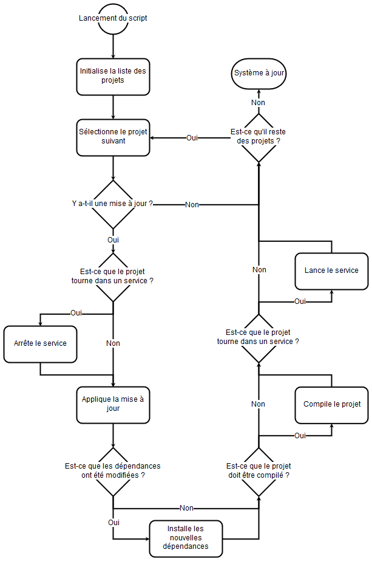

Intégration continue
====================

L'intégration continue est une méthodologie qui veut fournir des mises à jour fonctionnelles régulièrement. Y parvenir nécessite une rigueur de développement soutenue et une bonne compréhension de la méthodologie agile.

Le Process de Developpement
---------------------------

1) Lorsqu'une nouvelle fonctionnalité doit être ajouté, nous la codons sur la branche *dev*.
2) Lorsque la fonctionnalité est fini et que ses tests unitaires sont écrits, nous faisons une pull request sur la branche *master*.
3) Automatiquement travis détecte la pull request, lance tous les tests unitaires et fait un rapport.
4) Si le rapport confirme que tout est ok nous validons la pull request.

Le Process de Mise en Production
--------------------------------

### Diagramme

### Script

Une cron chez l'utilisateur `www-data` (propriétaire du dossier `/var/www/`) lance [le script](maj.sh) tous les quarts d'heures. En cas d'une erreur à une quelconque étape, un mail avec le rapport complet est envoyé à l'utilisateur `www-data` et une notification est envoyé sur le téléphone de Julien.
